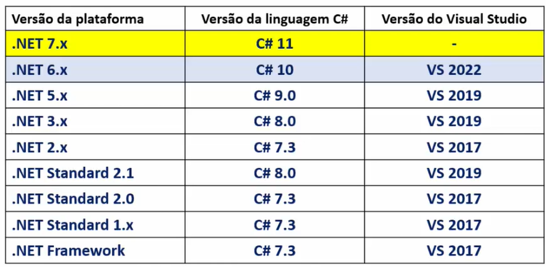

# IDEs

- An IDE (Integrated Development Environment) is a software application that provides comprehensive facilities to computer programmers for software development.
- Most used: Visual Studio, Visual Studio Code, JetBrains Rider, MonoDevelop, and Xamarin Studio.

## .NET SDK

- The .NET SDK (Software Development Kit) is a set of tools and libraries that developers use to build, test, and deploy .NET applications. It includes the .NET runtime, compilers, and various command-line tools for managing projects and dependencies.
- `dotnet --version`: Displays the version of the .NET SDK installed on your system.
- .NET Runtime: The runtime environment that executes .NET applications. It provides services like memory management, garbage collection, and exception handling.

# Visual Studio

## Template Projects

- Console Application: A simple command-line application that runs in a console window. It is suitable for small utilities and scripts.
- ASP.NET Core Web Application: A web application that uses the ASP.NET Core framework. It can be a web API, MVC application, or Razor Pages application.
- Class Library: A project that contains reusable code that can be shared across multiple applications. It compiles to a DLL (Dynamic Link Library) file.
- Unit Test Project: A project that contains unit tests for your code. It uses a testing framework like MSTest, NUnit, or xUnit to run tests and validate functionality.

## .NET CLI

- The .NET CLI (Command-Line Interface) is a cross-platform toolchain for developing, building, running, and publishing .NET applications. It provides commands for creating new projects, restoring dependencies, building applications, running tests, and publishing applications.
- `dotnet new`: Creates a new project or solution based on a specified template.
  - You can specify the template type using the `-t` or `--type` option, such as `console`, `web`, or `classlib`.
- `dotnet run`: Builds and runs the application in the current directory. It automatically restores dependencies and compiles the code before executing it.
- `dotnet build`: Compiles the application and its dependencies into a set of binaries. It generates an executable file for console applications or a DLL for class libraries.
- `dotnet restore`: Restores the dependencies and tools specified in the project file. It downloads the required packages from NuGet and prepares the project for building.
- `dotnet publish`: Prepares the application for deployment by compiling the code, restoring dependencies, and creating a self-contained package. It generates the necessary files to run the application on a target environment.
- `dotnet test`: Runs unit tests in the specified project or solution. It uses the testing framework specified in the project file to execute the tests and report results.
- `dotnet add/remove package`: Adds or removes NuGet packages to/from the project. It updates the project file and restores dependencies as needed.
- `dotnet sln`: Manages solution files. It allows you to add or remove projects from a solution, list projects in a solution, and create new solution files.

### Creating a New Console Project

- `dotnet new sln -o MySolution`: Creates a new solution file named `MySolution.sln` inside the `MySolution` directory. This solution file will be used to manage multiple projects within the solution.
- `cd MySolution`: Changes the current directory to `MySolution`, where the solution file is located.
- `dotnet new console -o MyConsoleApp`: Creates a new console application project named `MyConsoleApp` inside the `MySolution` directory. This project will contain the code for the console application.
- `dotnet sln MySolution.sln add MyConsoleApp/MyConsoleApp.csproj`: Adds the `MyConsoleApp` project to the `MySolution.sln` solution file. This allows you to manage multiple projects within a single solution.
- `code .`: Opens the current directory in Visual Studio Code. This command is useful for quickly launching the IDE to edit your project files.
