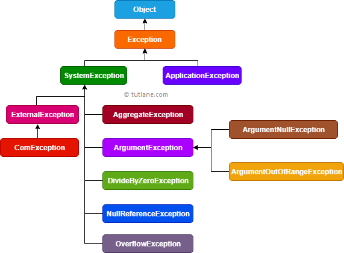

# Exceptions

- Exceptions are events that occur during the execution of a program that disrupt the normal flow of instructions. They can be caused by various issues, such as invalid input, resource unavailability, or programming errors.
- Exceptions can be handled using try-except blocks, allowing the program to continue running or to gracefully terminate instead of crashing.
- In C#, exceptions are represented by the `System.Exception` class and its derived classes.
- The `try` block contains the code that may throw an exception, while the `catch` block contains the code to handle the exception. `finally` block can be used to execute code that should run regardless of whether an exception occurred or not.

## Execution Stack

- The execution stack is a data structure that stores information about the active subroutines of a computer program.
- When an error occurs, the exception is thrown where the error occurred and passed up the execution stack until it is caught by a `catch` block or the program terminates.

## Exception Hierarchy

- The exception hierarchy in C# is a tree structure where `System.Exception` is the base class for all exceptions.
  
- Application exceptions are caused by application-specific errors, while system exceptions are caused by runtime errors (.NET Platform).

## Try-Catch-Finally

```csharp
try
{
    // Code that may throw an exception
}
catch (ExceptionType1 ex)
{
    // Handle specific exception type
}
catch (ExceptionType2 ex)
{
    // Handle another specific exception type
}
catch (Exception ex)
{
    // Handle general exceptions
}
finally
{
    // Code that always runs, regardless of whether an exception occurred or not
}
```
